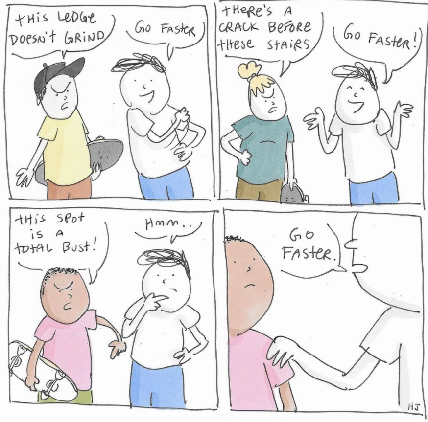

# Solidity Games (Fun Repository)
A repository for Solidity-based smart contract games.

## 1. Maybe Doubler
*Logic:* Send ETH to the contract and either get double back (if the Unix block timestamp is an integer) or lose the bet (if the Unix block timestamp is odd). The assumption is that the contract is sufficiently funded by enough lost bets!
- Deployed Rinkeby Contract Address: [0xAaf7f03f027938D236C5C67e4417e605ADE2f32b](https://rinkeby.etherscan.io/address/0xaaf7f03f027938d236c5c67e4417e605ade2f32b)

## 2. Roulette
*Logic:*     
`BetTypes` are as follow:
- 0: color
- 1: column
- 2: dozen
- 3: eighteen
- 4: modulus
- 5: number

Depending on the `BetType`, number will be:
- color: 0 for black, 1 for red
- column: 0 for left, 1 for middle, 2 for right
- dozen: 0 for first, 1 for second, 2 for third
- eighteen: 0 for low, 1 for high
- modulus: 0 for even, 1 for odd
- number: number

The roulette just accepts a bet when has sufficient funds to pay for it and every other active bet. Also, different people can be playing at the same time.

One of the players will click the *"Spin Wheel"* button, which will generate a random number and all bets will be dealt with accordingly.

When a player wins a bet, the payout is credited on his personal account. The player can, at any moment, click the *"Cash out"* button and receive their winnings. Be advised that, at a particular moment, the roulette could have insufficient funds to pay winnings for all players. Continue reading to understand why this could happen.

- Deployed Rinkeby Contract Address: [0xcbcA57B53e130A5f172CAE7B0DA30655a60c5B4A](https://rinkeby.etherscan.io/address/0xcbca57b53e130a5f172cae7b0da30655a60c5b4a)
### Randomness
True randomness is not possible in the Ethereum Virtual Machine (EVM), due to the way the virtual machine operates. When a smart contract is called, every node in the network will have to run the code, to validate it, and at the end the state must be the same for every node (consensus). If, hypothetically, there would be a true random function available, then, when every node call it, it would spill a different value, making it impossible to achieve consensus.

So, we have to use the current state of the blockchain to find a fair random number, and the formula I choose was to calculate the hash of several factors, and use the reminder of the division of that hash by 37. The factors used in the hash are:
- The blockhash of the previous block
- The current block timestamp
- The current block difficulty
- The last accepted bet
> The problem with this approach is that everyone who can see the state of the blockchain, can calculate (*"guess"*) the future random number, and bet on that number.

### Security
So, the first security measure implemented was to make the random number dependable on the last bet. So, if for example, an attacker calculates that the random number will be 13, by betting on 13 he will change the outcome of the random number, making this type of attack ineffective.

But an attacker could make an inverted attack, by betting on a number and then waiting for the state of the blockchain to be one that generates that specific number. For this attack to work, the attacker must fulfill 2 conditions:
1. Be able to control when is the spin of the wheel;
2. Be able to accurately guess the next random number.

Condition one is difficult, because anyone can spin the wheel, but there will be times where the attacker will be the only one on the roulette, making it possible. With an average time per block of 14.4 seconds, and for a bet with a payout of 36, on average the attacker will have to be alone in the roulette for 37 * 14.4 / 60 ~= 9 minutes.

Condition two, is harder. Two of the factors used in calculating the *"random"* number refer to the current block, that will only be known with the spinning of the wheel, thus making it impossible to guess the “random” number. The problem is that, even unknown, the values of the current block timestamp and difficulty are strongly predictable, and even worse, can be manipulated by a miner.

In a nutshell, for a regular player will be very hard to guess the random number, but the system is vulnerable to attacks by miners. So additional security measures were put in place.

### Balance Cap
Every time the wheel is spinned, and all payouts credited in the players accounts, the system verifies if the roulette balance is higher than 2 ether. If so, it send the excess to the contract owner (me). This way, the maximum amount of ether an attacker could steal is of 3 ether (a full roulette with 2 ether, plus 100 bets of 0.01 ether).

Bear in mind that the personal accounts of players (their respective winnings) are not taking in consideration when calculating the balance. In other words, a player could have more than 2 ether in their winnings accounts, but be unable to cash out since the roulette hasn’t sufficient funds to pay.

This is intended to prevent a Denial of Service attack, where a player could have all the roulette money in his winnings account, preventing other players to play. It's players responsability to be aware of this, and cash out frequently.

## 3. Tricks
*Logic:* Set a simple trick (e.g. Frontside Double Cork 1080) to be executed.

- Deployed Rinkeby Contract Address: [0x77219CBFA7F9284154E8ab5C7c8912B3f5834c22](https://rinkeby.etherscan.io/address/0x77219cbfa7f9284154e8ab5c7c8912b3f5834c22)

## 4. Blackjack
*Logic:* The contract follows the regular rules of [Blackjack](https://www.bicyclecards.com/how-to-play/blackjack/).
- Player hits/stands to beat dealer's hand by getting as close to 21 as possible
- Reno rule: Player can only double down on 9, 10, or 11
- Split under 21 rule

### Split under 21 rule
Modified split - If either of the player's hand in a split beats dealer, player wins bet on both hands automatically. But if Player busts on either deck, Dealer wins bet on both decks. On a split hand, If player's first hand has a standoff with dealer, player's other hand must beat dealer, otherwise dealer wins. If player's second hand stands off with dealer, player gets original bet back. On a split hand, the Player's split total is updated first, then when player stands, the Player's card total is updated. If either of these totals beats the dealer, player wins the split and receives the bet on both cards. Player can either double down or split, player cannot split then double down and vice versa.

- Deployed Rinkeby Contract Address: [0x0c7eec5d4E920414cfB1289Ea95CE92f5e82FE44](https://rinkeby.etherscan.io/address/0x0c7eec5d4e920414cfb1289ea95ce92f5e82fe44)
> Due to the following error arising in the Solidity compiler versions `>0.8.0`: *CompilerError: Stack too deep when compiling inline assembly: Variable value0 is 1 slot(s) too deep inside the stack.*, I deployed the contract with the compiler version `0.7.6`. My best guess is that this error occurs due to the fact that I declare more than 16 variables and the EVM stack has a 16 limit of variables.

## 5. Skate Swag
Improve your skate swag by exercising regularly. Work your way up to become the greatest skate swager! But don't forget to chill out a bit. For example, by buying a beer you may recover faster and be able to up-swap more. Find it out! 

- Deployed Rinkeby Contract Address: [0x0Cb24FEA6730Ad1Aa747857d1D9815F1f7D920de](https://rinkeby.etherscan.io/address/0x0cb24fea6730ad1aa747857d1d9815f1f7d920de)

© https://www.henryjonesstudio.com/

**Have fun!**

## References
- https://github.com/bordalix/ethereum-roulette
- https://github.com/JayOfemi/BlackJack/blob/master/BlackJack.sol